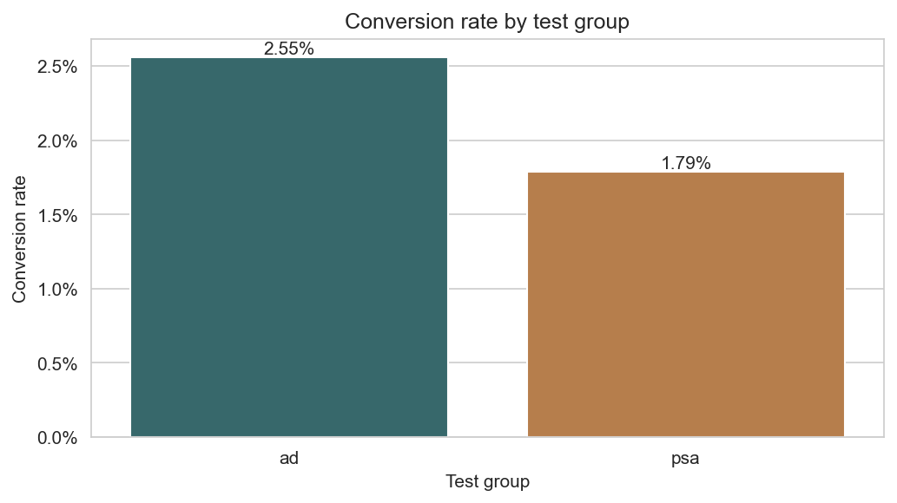
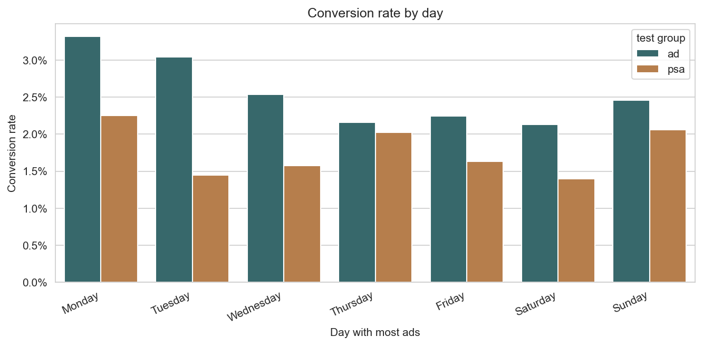
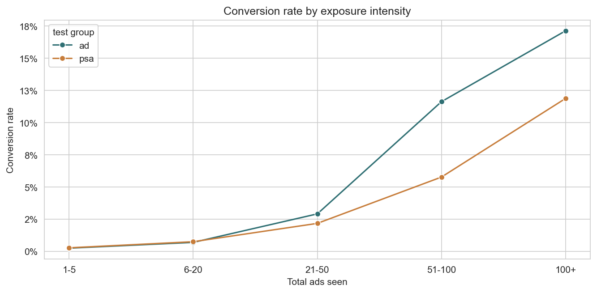

# A/B Test Conversion Analysis

> **Business question:** Did the ad campaign drive enough lift in conversion to justify scaling the spend?

## TL;DR Finding

The ad group converted at **2.55%** versus **1.79%** for the PSA group, a **0.77 percentage-point lift** and about **43% relative lift**. The result is statistically significant, but the experiment split was heavily imbalanced at roughly **96% ad / 4% PSA**, so I would treat the lift as a strong signal rather than clean proof of causality. My recommendation is to keep the campaign directionally alive, but run a properly randomized follow-up before scaling spend.

## Dataset

- **Source:** [Marketing A/B Testing - Kaggle](https://www.kaggle.com/datasets/faviovaz/marketing-ab-testing)
- **Size:** 588,101 rows
- **Columns:** user id, test group (ad/psa), converted (bool), total ads, most ads day, most ads hour
- **Known limitation:** group assignment is heavily imbalanced, which limits causal inference

## Approach

- Checked the data shape, missing values, group sizes, and conversion rates.
- Compared conversion between the ad group and PSA group.
- Ran a one-sided two-proportion z-test and cross-checked it with a chi-square test.
- Calculated the confidence interval around the lift so the recommendation is anchored on effect size, not just p-values.
- Cut the results by day, hour, and exposure intensity to see where the lift was strongest.

## Key Findings

- **The ad group converted higher:** ad users converted at **2.55%** vs **1.79%** for PSA, a **0.77 percentage-point lift**.
- **The result is statistically strong:** the one-sided z-test returned **z = 7.37** and **p = 8.53e-14**; the chi-square check agreed with **p = 1.71e-13**.
- **The practical effect is bounded:** the 95% confidence interval for the lift is **0.60 to 0.94 percentage points**.
- **The split is the main caveat:** **564,577 users** were in the ad group and only **23,524** were in PSA, so the raw lift may reflect selection bias as well as ad impact.
- **Segments point to useful follow-up targets:** Tuesday had the strongest raw day-level lift, followed by Monday, and the strongest practical response window appears to be afternoon/evening.

## Recommendation

I would not scale spend aggressively off this test alone. The campaign looks promising, but the assignment pattern is too lopsided for me to call the observed lift a clean causal effect.

The next move is a cleaner follow-up test: randomly assign users before exposure, use a more balanced treatment/control split, define the conversion window up front, and focus the test around the strongest day and hour windows from this analysis. If that follow-up reproduces even part of the 0.77 percentage-point lift, then scaling becomes a much easier call.

## Limitations

- Selection bias: groups may not have been randomly assigned, so observed lift likely overstates the true causal effect.
- No timestamp granularity beyond day/hour, so I cannot fully separate timing effects from audience behavior.
- Conversion is binary; the dataset does not include purchase value, revenue, or downstream lifetime value.
- Exposure intensity is confounded: frequent users see more ads and may have been more likely to convert anyway.

## Reproducibility

```bash
# Clone the repo
git clone https://github.com/FaisalAlsurayhi/ab-test-conversion-analysis.git
cd ab-test-conversion-analysis

# Create virtual environment
python -m venv venv
venv\Scripts\activate  # Windows
# source venv/bin/activate  # Mac/Linux

# Install dependencies
pip install -r requirements.txt

# Download the dataset from Kaggle and place marketing_AB.csv in data/
# Then run the notebooks in order: 01 -> 02 -> 03 -> 04
```

## Visuals







---

*Built by Faisal Alsurayhi as part of a data analyst portfolio focused on Saudi Arabia's Eastern Province market.*
